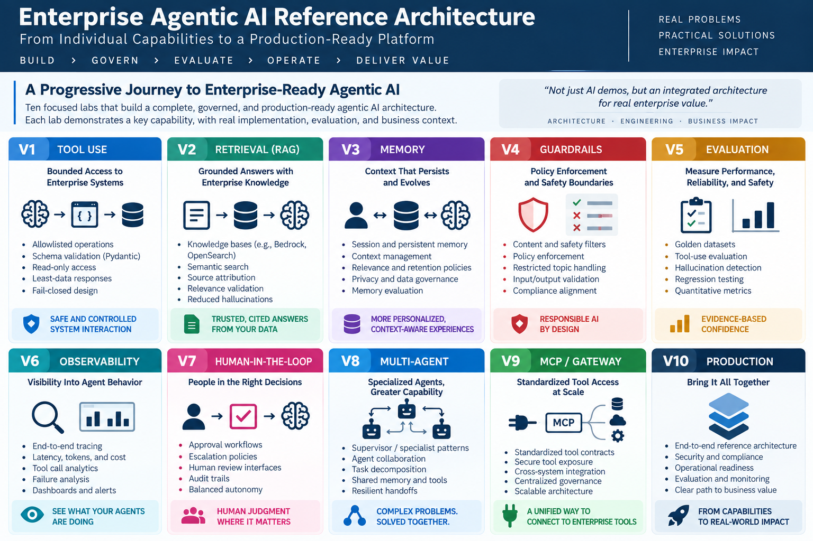
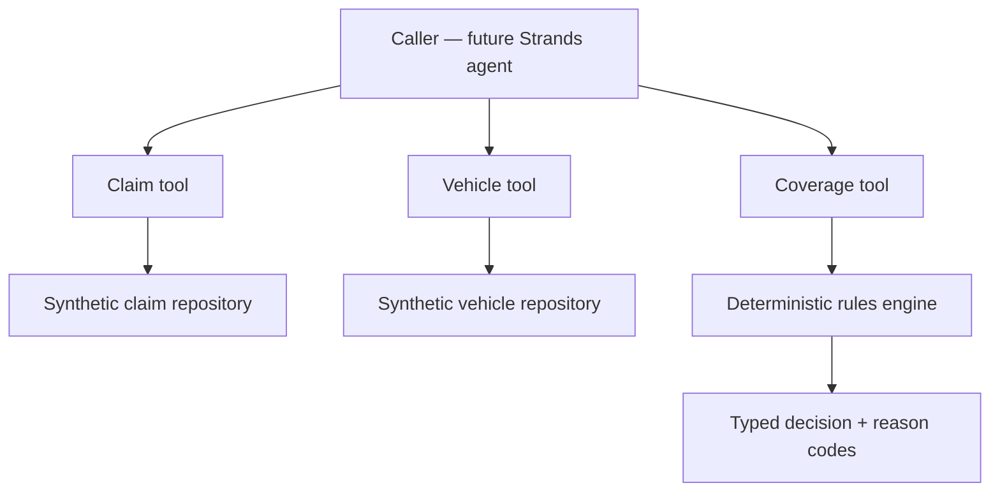
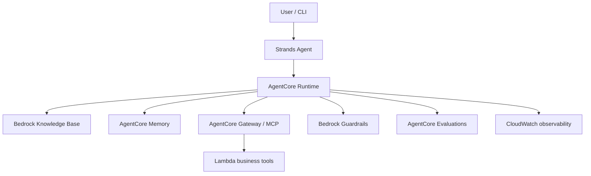

# Agentic AI Reference Architecture Exercise

A hands-on, production-minded AWS portfolio project demonstrating a reusable enterprise pattern across **orchestration, retrieval, memory, tools, guardrails, evaluation, and observability**.

## Business scenario

The reference implementation is an **Enterprise Warranty Decision Agent** operating exclusively on synthetic claims, vehicles, and policies. The system gathers structured facts, applies deterministic rules, and returns `APPROVE`, `DENY`, or `HUMAN_REVIEW` with stable reason codes and policy references.

This is an educational reference architecture—not a production claims-decision system.

## Enterprise Agentic AI journey

This repository is designed as a progressive, hands-on journey from individual agent capabilities to a **production-ready enterprise Agentic AI architecture**. Each stage adds a distinct architectural capability while preserving the same core principles: controlled autonomy, deterministic boundaries, measurable behavior, and clear business context.



| Stage | Capability | Executive outcome |
| --- | --- | --- |
| **V1** | Tool Use | Safe, controlled interaction with enterprise systems |
| **V2** | Retrieval (RAG) | Grounded answers from authoritative enterprise knowledge |
| **V3** | Memory | Context-aware experiences that persist appropriately over time |
| **V4** | Guardrails | Policy enforcement, safety boundaries, and responsible AI controls |
| **V5** | Evaluation | Evidence-based confidence in quality, reliability, and safety |
| **V6** | Observability | Visibility into agent behavior, performance, cost, and failures |
| **V7** | Human-in-the-Loop | Human judgment and approval for consequential decisions |
| **V8** | Multi-Agent | Specialized agents collaborating on complex, multi-step work |
| **V9** | MCP / Gateway | Standardized, governed access to enterprise tools and services |
| **V10** | Production | An integrated, secure, observable, governed, and business-ready architecture |

The progression intentionally moves beyond isolated AI demos. The objective is to demonstrate how **architecture, engineering, governance, evaluation, and business value** come together as agentic systems mature toward enterprise production.

## V1 architecture



The model orchestrates approved tools. It does not own system facts, coverage rules, or authorization.

## Target AWS architecture



## Implemented in V1

- Pydantic contracts for claims, vehicles, and decisions
- JSON repository adapters designed to be replaceable by AWS-backed implementations
- Independent `get_claim_details`, `get_vehicle_details`, and `calculate_coverage` tools
- Deterministic coverage logic with explicit reason codes
- Human-review routing for missing, ambiguous, unrelated-modification, and conflicting evidence
- Ten-case golden evaluation dataset and repeatable runner
- Unit tests, architectural documentation, and decision records

## Implemented in V1.1

- Local Strands agent configured for an Amazon Bedrock model
- Controlled tool registry around the three deterministic services
- Explicit orchestration instructions and trust boundaries
- Per-tool trace capture for tool name, sequence, arguments, result, and error
- Deterministic final-response formatting from validated coverage output
- Offline orchestration baseline that requires neither Strands nor AWS
- Ten orchestration scenarios covering normal, ambiguous, missing-record, bypass, and VIN-substitution requests
- Metrics for tool selection, order, argument accuracy, and decision fidelity

## Implemented in V1.2 — bounded Bedrock tool use

- Read-only `lookup_claim_status` tool that exposes only `status` and `reason`
- Amazon Bedrock Converse tool specification with a strict JSON input schema
- Pydantic validation for model-supplied arguments
- Explicit tool allowlist and rejection of unapproved tool names
- Bounded two-call orchestration: tool request followed by final response
- Fail-closed behavior for direct answers, malformed requests, multiple tool calls, and unknown claims
- Live validation for known and unknown synthetic claims
- 17-test regression suite passing at the Lab 1 checkpoint

See [Lab 1: Bounded Amazon Bedrock Tool Use](docs/05-bounded-bedrock-tool-use.md) for the flow diagram, code map, controls, and validation steps.

## Quick start

```bash
python -m venv .venv
source .venv/bin/activate
pip install -e ".[dev]"
pytest
python -m evaluation.run_evaluation
python -m evaluation.run_orchestration_evaluation
python -m src.agent.app --claim-id CLM-1001
```

### Run the bounded Bedrock claim-status assistant

```bash
uv sync --extra dev
export AWS_REGION=us-east-1
export BEDROCK_MODEL_ID=<your-enabled-inference-profile-id>

uv run python -m src.agent.claim_status_cli \
  "What is the status of claim CLM-1002?"
```

The assistant uses synthetic data and exposes no write or claim-approval operation.

### Run the live Strands path

Configure AWS credentials with permission to invoke an enabled Amazon Bedrock model, then install the optional agent dependency:

```bash
pip install -e ".[dev,agent]"
export AWS_REGION=us-west-2
export BEDROCK_MODEL_ID=<your-enabled-bedrock-model-id>

python -m src.orchestration.agent \
  --prompt "Review claim CLM-1001 and explain the recommendation."
```

Run the live 10-case benchmark:

```bash
python -m evaluation.run_orchestration_evaluation --mode live
```

The live runner invokes Amazon Bedrock and may incur model usage charges. Its result is intentionally reported separately from the offline baseline.

## Documentation

- [Roadmap](ROADMAP.md)
- [Problem statement](docs/01-problem-statement.md)
- [V1 architecture](docs/02-v1-architecture.md)
- [Data model](docs/03-data-model.md)
- [V1.1 orchestration](docs/04-orchestration.md)
- [V1.2 Lab 1: Bounded Amazon Bedrock Tool Use](docs/05-bounded-bedrock-tool-use.md)
- [ADR-001: Deterministic business rules](docs/decisions/ADR-001-deterministic-business-rules.md)
- [ADR-002: Synthetic data only](docs/decisions/ADR-002-synthetic-data-only.md)
- [ADR-003: Agent orchestrates; rules remain deterministic](docs/decisions/ADR-003-agent-orchestrates-rules-remain-deterministic.md)

## Responsible-use boundaries

- No OEM, dealer, customer, production, or confidential data
- No autonomous claim approval or write-back
- No LLM-owned business rules or authorization
- Ambiguous and conflicting evidence routes to human review
- AWS permissions will follow least privilege; secrets will not be committed
