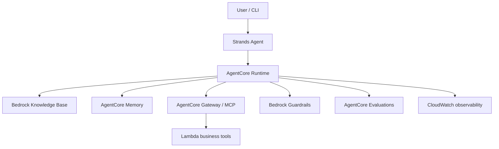

# Agentic AI Reference Architecture Exercise

A hands-on, production-minded AWS portfolio project demonstrating how to design and implement a reusable enterprise agentic AI pattern across **orchestration, retrieval, memory, tools, guardrails, evaluation, and observability**.

> Status: Foundation established. V1 implementation is the next milestone.

## Business scenario

The reference implementation is an **Enterprise Warranty Decision Agent** operating only on synthetic claims, vehicles, and policy documents. Given a claim, it gathers structured facts, retrieves applicable policy, recommends `APPROVE`, `DENY`, or `HUMAN_REVIEW`, cites evidence, and explains uncertainty.

This is an educational reference architecture—not a production claims-decision system.

## Target architecture



## Capabilities demonstrated

| Capability | Design question | AWS direction |
|---|---|---|
| Orchestration | Who decides what happens next? | Strands Agents + AgentCore Runtime |
| Retrieval | What enterprise knowledge is relevant? | S3 + Bedrock Knowledge Bases |
| Memory | What should persist within/across sessions? | AgentCore Memory |
| Tools | How does the agent safely act? | AgentCore Gateway, MCP, Lambda |
| Guardrails | What may the agent say or do? | Bedrock Guardrails |
| Evaluation | How do we measure behavior repeatedly? | Golden dataset + AgentCore Evaluations |
| Observability | Why did the agent make that decision? | AgentCore Observability + CloudWatch |

## Delivery plan

1. **V1 — Agent + deterministic tools:** claim, vehicle, and coverage tools.
2. **V2 — Retrieval:** policy documents, citations, filtering, and reranking experiments.
3. **V3 — Memory:** explicit short-term and long-term use cases.
4. **V4 — Security and governance:** PII controls, prompt-injection resistance, grounding, least privilege, and human approval.
5. **V5 — Evaluation and observability:** golden dataset, automated scoring, traces, latency, and cost metrics.

See [ROADMAP.md](ROADMAP.md) and [docs/01-problem-statement.md](docs/01-problem-statement.md).

## Repository structure

```text
docs/             Architecture decisions and learning journal
src/              Agent and deterministic business tools
data/synthetic/   Fabricated examples safe for a public portfolio
evaluation/       Golden dataset, runner, and metric definitions
infrastructure/   Terraform modules and environments
tests/            Unit, integration, retrieval, and security tests
```

## Quick start

```bash
python -m venv .venv
source .venv/bin/activate
pip install -e ".[dev]"
pytest
python -m src.agent.app --claim-id CLM-1001
```

The starter implementation intentionally runs locally with synthetic data before AWS resources are introduced.

## Responsible-use boundaries

- No Toyota, dealer, customer, production, or confidential data.
- No autonomous claim approval or write-back.
- Recommendations require evidence and expose uncertainty.
- High-risk, ambiguous, or contradictory cases route to human review.
- AWS permissions will follow least privilege; secrets will not be committed.

## Portfolio outcomes

The completed project will include architecture diagrams, ADRs, Terraform, reproducible tests, evaluation scorecards, threat-model findings, execution traces, cost observations, and lessons learned.
