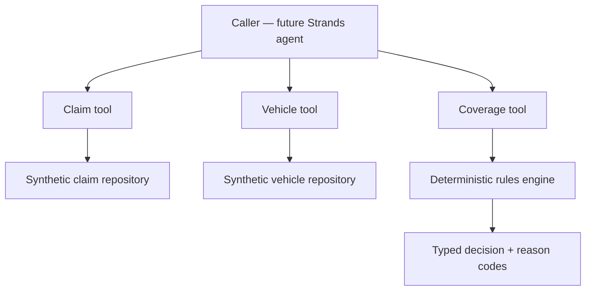
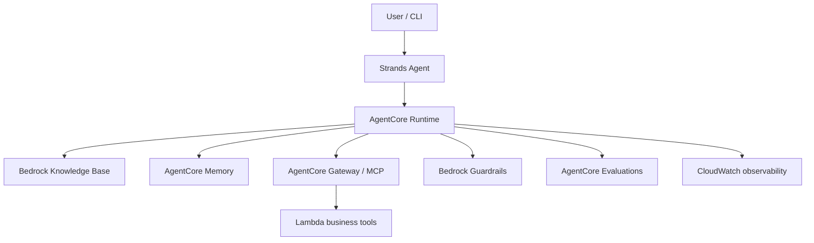

# Agentic AI Reference Architecture Exercise

A hands-on, production-minded AWS portfolio project demonstrating a reusable enterprise pattern across **orchestration, retrieval, memory, tools, guardrails, evaluation, and observability**.

> Status: V1 deterministic foundation complete — 10/10 golden scenarios passing. Strands orchestration is next.

## Business scenario

The reference implementation is an **Enterprise Warranty Decision Agent** operating exclusively on synthetic claims, vehicles, and policies. The system gathers structured facts, applies deterministic rules, and returns `APPROVE`, `DENY`, or `HUMAN_REVIEW` with stable reason codes and policy references.

This is an educational reference architecture—not a production claims-decision system.

## V1 architecture



The model will eventually orchestrate the tools. It will not own system facts, coverage rules, or authorization.

## Target AWS architecture



## Implemented in V1

- Pydantic contracts for claims, vehicles, and decisions
- JSON repository adapters designed to be replaceable by AWS-backed implementations
- Independent `get_claim_details`, `get_vehicle_details`, and `calculate_coverage` tools
- Deterministic coverage logic with explicit reason codes
- Human-review routing for missing, ambiguous, unrelated-modification, and conflicting evidence
- Ten-case golden evaluation dataset and repeatable runner
- Unit tests, architectural documentation, and decision records

## Quick start

```bash
python -m venv .venv
source .venv/bin/activate
pip install -e ".[dev]"
pytest
python -m evaluation.run_evaluation
python -m src.agent.app --claim-id CLM-1001
```

## Documentation

- [Roadmap](ROADMAP.md)
- [Problem statement](docs/01-problem-statement.md)
- [V1 architecture](docs/02-v1-architecture.md)
- [Data model](docs/03-data-model.md)
- [ADR-001: Deterministic business rules](docs/decisions/ADR-001-deterministic-business-rules.md)
- [ADR-002: Synthetic data only](docs/decisions/ADR-002-synthetic-data-only.md)

## Responsible-use boundaries

- No OEM, dealer, customer, production, or confidential data
- No autonomous claim approval or write-back
- No LLM-owned business rules or authorization
- Ambiguous and conflicting evidence routes to human review
- AWS permissions will follow least privilege; secrets will not be committed
