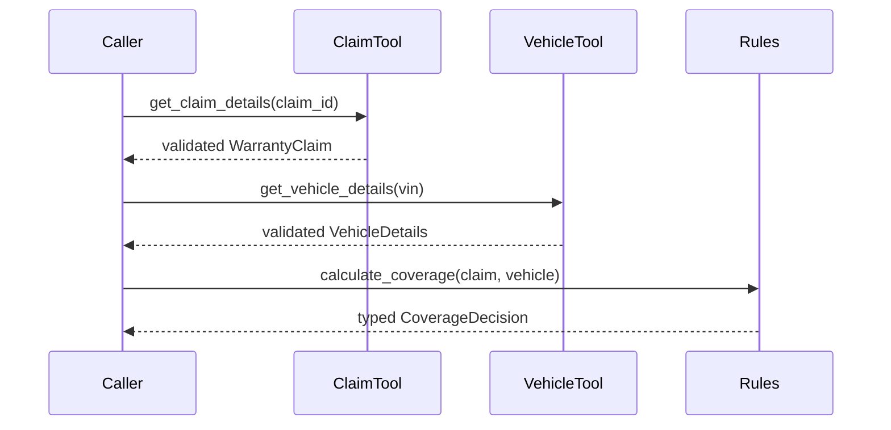

# V1 Deterministic Architecture

V1 creates a stable business-services layer beneath the future agent. The model will eventually select and sequence tools, but it will not own claim facts, vehicle facts, eligibility rules, or authorization.

The JSON repositories are replaceable adapters. Later phases can swap them for Lambda and DynamoDB while preserving the tool contracts.
