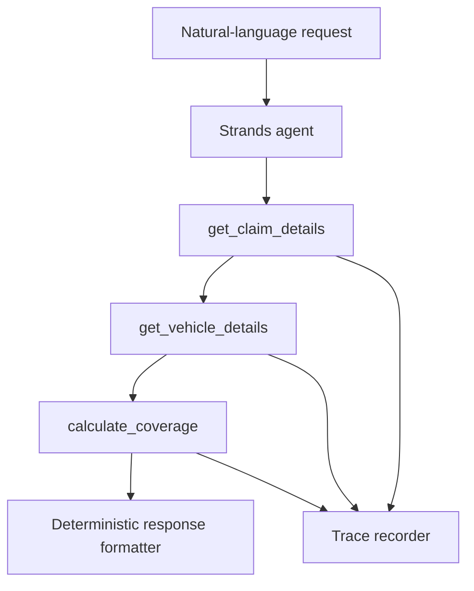

# V1.1 — Strands orchestration

## Objective

V1.1 tests whether a language-model agent can select, sequence, and parameterize trusted business tools. It does not transfer coverage authority to the model.

## Control boundary

The Strands agent may interpret intent and choose tools. The tool layer owns validated facts; the rules engine owns the recommendation; the formatter owns the user-facing decision fields. Free-form model prose is retained in the result for inspection but cannot override the deterministic recommendation.

## Two evaluation modes

### Offline baseline

`python -m evaluation.run_orchestration_evaluation`

The baseline uses a deterministic test double to validate the registry, trace schema, tool contracts, error paths, metrics, and response fidelity without AWS calls. A passing baseline does not prove model behavior.

### Live Strands benchmark

`python -m evaluation.run_orchestration_evaluation --mode live`

The live path uses Strands and Amazon Bedrock. It measures the model's actual tool selection, sequence, arguments, and decision fidelity against the same dataset. AWS credentials, Bedrock model access, and `BEDROCK_MODEL_ID` are required.

## Evaluated behaviors

- Correct three-tool sequence for valid claims
- No tool call when a claim ID is missing
- Controlled failure for unknown claim or vehicle records
- Refusal to bypass deterministic coverage calculation
- Use of the VIN returned by the claim tool instead of a user-supplied substitution
- Preservation of `APPROVE`, `DENY`, or `HUMAN_REVIEW` from the coverage tool

## Current limitation

The repository records application-level business-tool traces. AgentCore Runtime, managed observability, memory, retrieval, guardrails, and AWS deployment are later increments.
