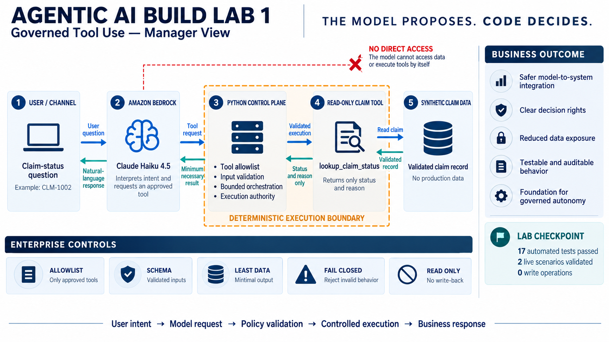
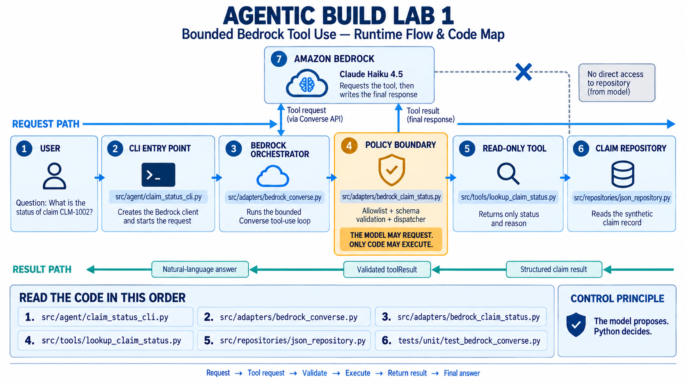
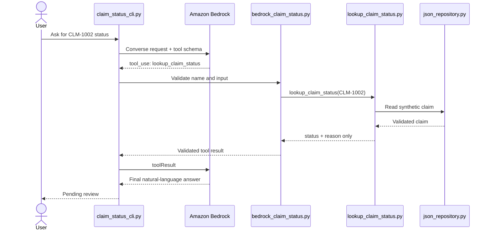

# Lab 1: Bounded Amazon Bedrock Tool Use



## Solution summary

### What it does

This solution provides a business user with a natural-language way to retrieve the current status of a synthetic warranty claim. The assistant can answer questions such as "What is the status of claim CLM-1002?" while remaining strictly read-only. It cannot approve, deny, modify, or write back a claim.

### How it does it

Amazon Bedrock interprets the user’s intent and requests the approved `lookup_claim_status` tool. A deterministic Python control plane then validates the tool name and input, enforces a bounded interaction, and authorizes execution. The read-only tool retrieves the synthetic claim and returns only the minimum necessary fields: `status` and `reason`. Bedrock converts that validated result into a clear response for the user.

The model never receives direct access to the claim repository and cannot execute a tool independently.

### What it means for the business

This pattern enables organizations to use flexible AI reasoning without transferring business authority to the model. It establishes clear decision rights, reduces unnecessary data exposure, creates testable and auditable behavior, and provides a safer foundation for expanding agentic AI into enterprise workflows.

> **Control principle:** The model proposes. Python decides.

## Technical runtime flow



## Scenario

A user asks: `What is the status of claim CLM-1002?`

The assistant may retrieve a synthetic claim status, but it cannot approve, deny, modify, or write back a claim. The tool exposes only two fields: `status` and `reason`.

## Runtime flow and code map

| Step | Component | File | Responsibility |
|---|---|---|---|
| 1 | CLI entry point | `src/agent/claim_status_cli.py` | Reads the question, creates the Bedrock Runtime client, and starts the workflow. |
| 2 | Bedrock orchestrator | `src/adapters/bedrock_converse.py` | Runs one bounded request → tool use → tool result → final response sequence. |
| 3 | Policy boundary | `src/adapters/bedrock_claim_status.py` | Defines the tool schema, allowlists the tool name, validates model-supplied input, and dispatches the call. |
| 4 | Read-only tool | `src/tools/lookup_claim_status.py` | Returns the minimum approved status projection and converts a missing claim into a controlled response. |
| 5 | Existing claim service | `src/tools/get_claim_details.py` | Retrieves one validated synthetic claim. |
| 6 | Synthetic repository | `src/repositories/json_repository.py` | Reads the claim record from local synthetic JSON data. |
| 7 | Tests | `tests/unit/test_bedrock_converse.py` and related tests | Prove the model cannot bypass the required tool or invoke an unapproved tool. |

## Sequence



Amazon Bedrock never receives direct repository access. Every execution path passes through the Python policy boundary.

## Enforced controls

- **Tool allowlist:** only `lookup_claim_status` is accepted.
- **Schema validation:** Pydantic rejects malformed claim IDs and unexpected fields.
- **Exactly one tool request:** the orchestrator rejects zero or multiple tool calls.
- **Tool use required:** a direct model answer is treated as a failed workflow.
- **Least-data response:** the tool returns only `status` and `reason`.
- **Read-only behavior:** no approval, denial, mutation, or write-back capability exists.
- **Fail-closed lookup:** an unknown claim returns `unavailable / claim_not_found`.
- **Bounded model loop:** one tool round trip is allowed before the final answer.

## Run the lab

Prerequisites:

- Python 3.11 or newer
- `uv`
- AWS credentials with permission to invoke an enabled Bedrock model
- An Amazon Bedrock inference profile that supports Converse tool use

```bash
uv sync --extra dev

export AWS_REGION=us-east-1
export BEDROCK_MODEL_ID=<your-enabled-inference-profile-id>

uv run python -m src.agent.claim_status_cli \
  "What is the status of claim CLM-1002?"
```

Validate the controlled missing-claim path:

```bash
uv run python -m src.agent.claim_status_cli \
  "What is the status of claim CLM-9999?"
```

## Test the boundary

```bash
uv run python -m pytest tests/unit/test_claim_status_boundary.py -q
uv run python -m pytest tests/unit/test_bedrock_claim_status.py -q
uv run python -m pytest tests/unit/test_bedrock_converse.py -q
uv run python -m pytest -q
```

Validation snapshot from the completed lab:

- 17 automated tests passed.
- The known-claim live scenario returned `pending_review / documentation_incomplete`.
- The unknown-claim live scenario returned `unavailable / claim_not_found`.
- No write operation was exposed or executed.

## Recommended reading order

1. `src/agent/claim_status_cli.py`
2. `src/adapters/bedrock_converse.py`
3. `src/adapters/bedrock_claim_status.py`
4. `src/tools/lookup_claim_status.py`
5. `src/repositories/json_repository.py`
6. `tests/unit/test_bedrock_converse.py`

## Enterprise architecture significance

Prompts guide model behavior, but they are not authorization controls. The enforceable control is the deterministic application layer that validates intent before permitting access to enterprise capabilities.

This read-only pattern is a foundation for later capabilities such as MCP exposure, identity-aware authorization, audit logging, observability, human approval, and transaction-level policy controls.
