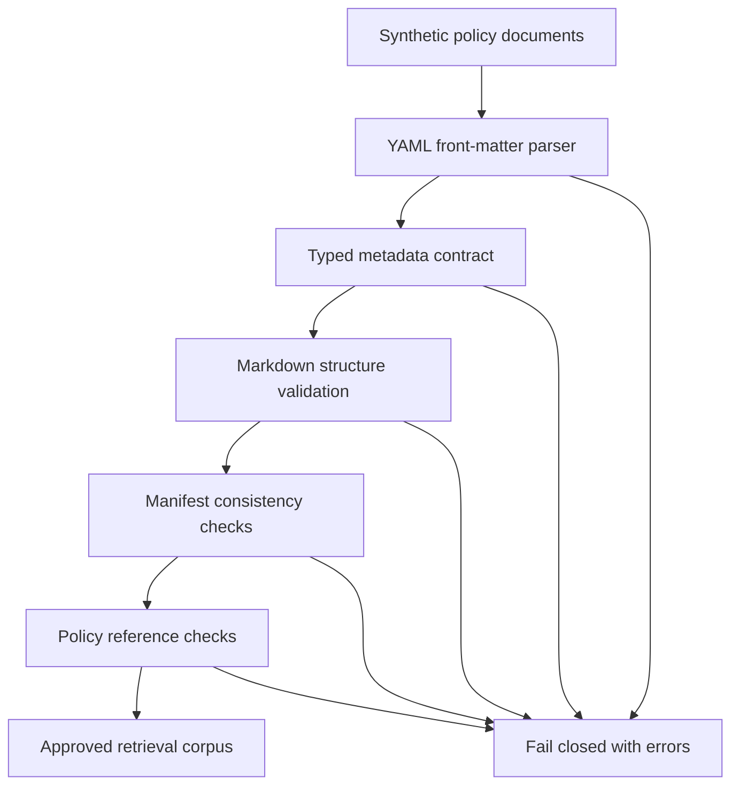

# V2.2 — Machine-Enforced Policy Corpus Contracts

## Executive summary

V2.2 turns the synthetic warranty policy collection into a governed, machine-verifiable knowledge corpus.

Before a policy can be used for retrieval or uploaded to an Amazon Bedrock Knowledge Base, automated controls verify its metadata, Markdown structure, manifest registration, source URI, and policy references. Invalid content fails closed with an actionable error.

This reduces the risk of grounding an AI agent on malformed, incorrectly classified, unregistered, or internally inconsistent enterprise knowledge.


*V2.2 quality-control flow: policy content is checked against machine-enforced contracts before it becomes an approved retrieval corpus.*

## Business outcome

The solution establishes a repeatable quality gate for authoritative AI knowledge sources.

It demonstrates how an enterprise can apply data-quality and software-engineering controls to unstructured documents before they become part of a retrieval-augmented generation system.

## Validation flow



## Components

| Component | Responsibility |
| --- | --- |
| `policy_contracts.py` | Defines typed policy and manifest contracts with Pydantic |
| `policy_loader.py` | Reads Markdown, parses YAML front matter, and validates document structure |
| `corpus_validator.py` | Validates all documents against the authoritative manifest |
| `validate_corpus.py` | Provides a command-line validation quality gate |
| `manifest.json` | Registers the authoritative set of synthetic policy documents |
| `test_policy_corpus.py` | Verifies successful validation and expected failure behavior |
| `quality.yml` | Runs formatting, linting, corpus validation, and tests in GitHub Actions |

## Metadata contract

Every policy document must provide:

- `document_id`
- `title`
- `category`
- `component`
- `market`
- `effective_date`
- `version`
- `status`
- `source_uri`
- `classification`

The contract rejects:

- Missing required fields
- Unexpected fields
- Invalid document identifiers
- Invalid versions or dates
- Unsupported statuses
- Incorrect market or classification values
- Invalid source URI formats

## Document structure contract

Every policy document must contain:

- Exactly one H1 title
- An H1 title matching the metadata title
- A synthetic-policy disclaimer immediately after the title
- At least four numbered policy sections
- Sequential section numbers beginning with `1.0`
- Section headings using `## N.0 Section title`

Section names are allowed to vary because different policies have different purposes.

## Corpus-level controls

The corpus validator verifies that:

- Every manifest entry points to an existing document
- Every policy document is registered in the manifest
- Document IDs and paths are unique
- Document IDs, categories, and components agree with the manifest
- Market and classification values agree with corpus-level values
- Each source URI corresponds to the document path
- Every `SYN-POL-###` reference resolves to a registered policy

## Fail-closed behavior

Validation returns a nonzero process exit code when any contract is violated. This allows local development and automated pipelines to prevent invalid knowledge from moving forward.

Run the validation locally:

```bash
uv run python -m src.retrieval.validate_corpus
```

Successful output:

```text
PASS: validated 20 policies in data/policies
```

## Automated quality gate

GitHub Actions runs the following checks on pushes and pull requests targeting `main`:

```text
Dependency synchronization
        ↓
Formatting validation
        ↓
Static lint checks
        ↓
Policy corpus validation
        ↓
Automated tests
```

No AWS credentials are required because V2.2 validates the corpus locally before cloud deployment.

## Verification evidence

At completion:

- 20 synthetic policy documents validated
- 12 retrieval and corpus tests passed
- 29 total repository tests passed
- Ruff formatting passed
- Ruff lint checks passed
- Local validation CLI passed

Tests include deliberate failures for:

- Missing YAML front matter
- Undeclared metadata fields
- Policy and manifest disagreements
- Unregistered policy files
- Incorrect document titles
- Missing synthetic-data disclaimers
- Nonsequential section numbers
- References to nonexistent policies
- Missing corpus directories

## Architectural boundary

V2.2 does not yet:

- Upload documents to Amazon S3
- Provision a Bedrock Knowledge Base
- Generate embeddings
- Perform semantic retrieval
- Produce model-generated answers

It establishes the trusted document foundation required for those later capabilities.

## Next step

V2.3 will define the S3 document layout and typed retrieval and citation contracts needed before implementing the local retrieval baseline and Bedrock Knowledge Base.